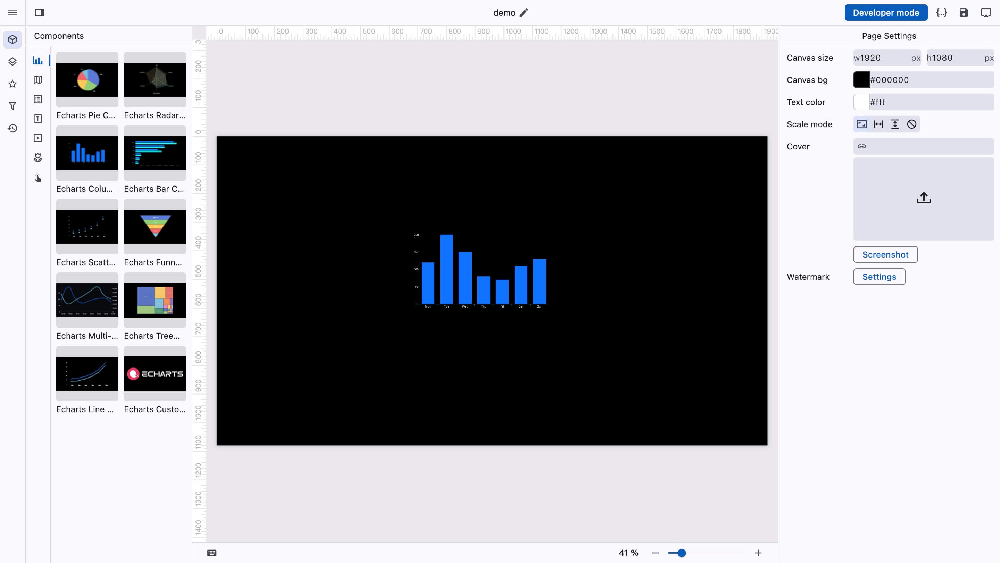

# Insert a component

You can drag and drop components directly from the component panel onto the canvas, or click a component to add it to the top-left corner of the canvas.

<figure><figcaption></figcaption></figure>
