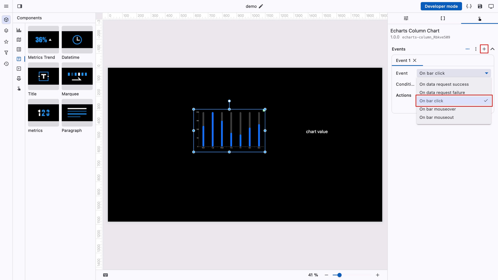
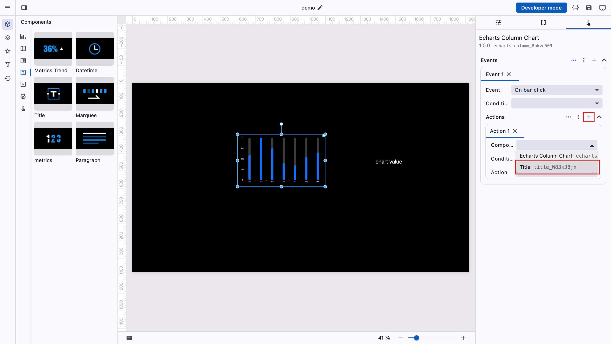
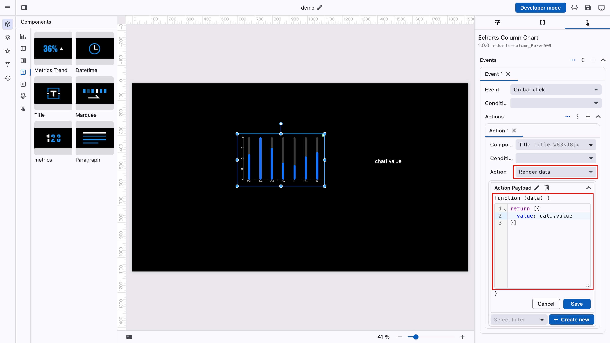
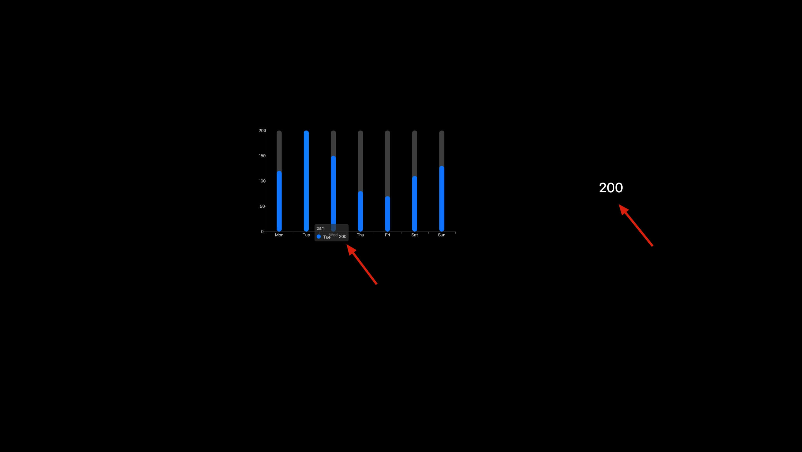

# 设置交互

新增一个 title 组件，演示点击柱状图时，让 title 组件显示对应的数据。

选中柱状图组件，切换到"交互配置"标签页，新增一个事件，选择"点击柱子时"。

<figure><figcaption></figcaption></figure>

新增一个动作，选择 title 组件。

<figure><figcaption></figcaption></figure>

选择"渲染数据"，通过 title 组件的数据规范完善函数体。

<figure><figcaption></figcaption></figure>

点击预览，即可看到交互效果。

<figure><figcaption></figcaption></figure>
